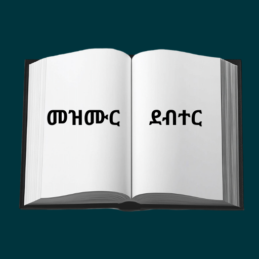
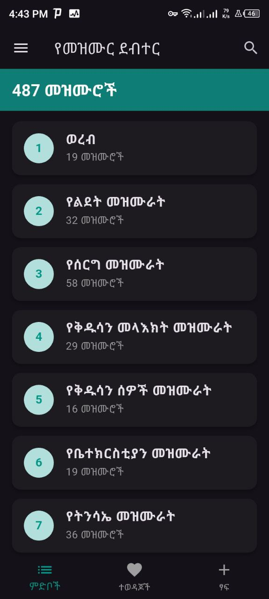

# መዝሙር ደብተር 

A new Flutter project.

## poem App (Songwriter & Lyric Manager)

An Android application for songwriters, poets, and creative writers to write, organize, and save lyrics locally.

##the main goal 
it is devloped for sunday school students to write the lyrics of hymn into their phone and arrange in the brife floders and use for sunday service
A few resources to get you started if this is your first Flutter project:

- [Lab: Write your first Flutter app](https://docs.flutter.dev/get-started/codelab)
- [Cookbook: Useful Flutter samples](https://docs.flutter.dev/cookbook)

For help getting started with Flutter development, view the
[online documentation](https://docs.flutter.dev/), which offers tutorials,
samples, guidance on mobile development, and a full API reference.

